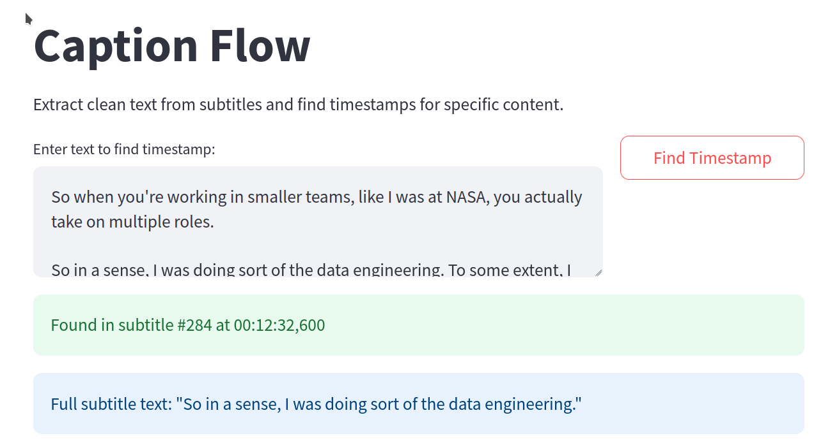
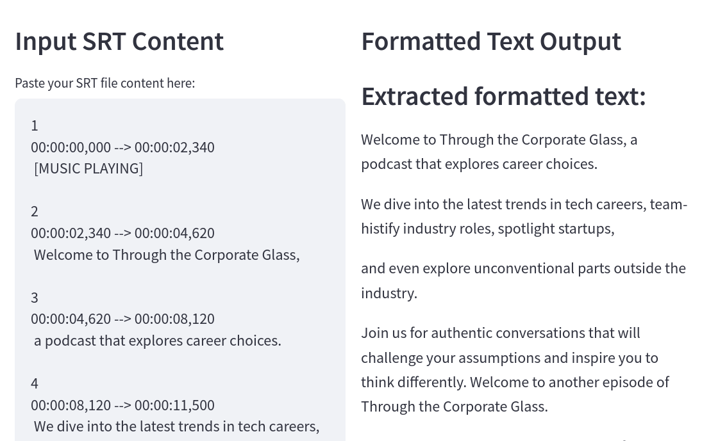

# Caption Flow

Some scripts and small webapp for working with SRT subtitle files, featuring text extraction, paragraph formatting, and timestamp lookup. Used in the workflow for this podcast: [Through The Corporate Glass](https://www.throughthecorporateglass.com/)

Built partly to play around with some software tools:

* [Claude Code](https://www.anthropic.com/news/claude-3-7-sonnet) was used to create this app, esp the [`caption-flow-app.py`](caption-flow-app.py) Streamlit app. The prompts used are in [this PDF](claude-prompt-session-srt-analyzer.pdf).

* The [`generate-transcript.py`](generate-transcript.py) script was created using [VS Code Insider](https://code.visualstudio.com/insiders/). The prompts used are in [this PDF](vs-code-prompts-1.pdf).

Pretty much the rest of this README below was generated by Claude Code, not handwritten.




## Features

- **Clean Text Extraction**: Extract readable text from SRT files, removing timestamps and formatting
- **Smart Paragraph Formation**: Automatically organize text into logical paragraphs based on content
- **Timestamp Lookup**: Find the exact timestamp where a specific quote appears in the video
- **Interactive Web Interface**: User-friendly Streamlit app for processing SRT files
- **Standalone CLI Tools**: Use the Python scripts directly from the command line

## Installation

### Prerequisites

- Python 3.8 or higher

### Option 1: Using a virtual environment (recommended)

```bash
# Clone the repository
git clone https://github.com/yourusername/annotate-subs.git
cd annotate-subs

# Create a virtual environment
python -m venv venv

# Activate the virtual environment
source venv/bin/activate  # On Linux/Mac
# or
# venv\Scripts\activate  # On Windows

# Install dependencies
pip install -r requirements.txt
```

### Option 2: Global installation

```bash
# Clone the repository
git clone https://github.com/yourusername/annotate-subs.git
cd annotate-subs

# Install dependencies
pip install -r requirements.txt
```

## Usage

### Web Application

The easiest way to use the Caption Flow is through the Streamlit web interface:

```bash
streamlit run caption-flow-app.py
```

This will open a web interface in your browser where you can:
1. Paste your SRT file content
2. Process it to extract clean text
3. Search for specific snippets to find their timestamps

### Command Line Tools

### Generate Transcript

The `generate-transcript.py` script is used to generate transcripts from audio files using the `whisper-cli` tool. It supports specifying the input audio file, output transcript file, Whisper CPP home directory, and duration in seconds for processing.

### Usage

```bash
python generate-transcript.py --input-audio-file=<input_audio_file> [--output-transcript-file=<output_transcript_file>] [--whisper-cpp-home=<whisper_cpp_home>] [--duration-sec=<duration_sec>]
```

### Example

```bash
python generate-transcript.py --input-audio-file=/path/to/audio.wav --output-transcript-file=/path/to/output.srt --whisper-cpp-home=/path/to/whisper.cpp --duration-sec=60
```

This will generate a transcript for the specified audio file and save it to the specified output file.

### Generate Short Video

The `generate-short-video.py` script is used to generate short videos from an image, audio, and subtitle file. It supports specifying the input image, input audio, input subtitle file, start time, end time, and output file.

### Usage

```bash
python generate-short-video.py --input-image=<input_image> --input-audio=<input_audio> --input-srt=<input_srt> --start-time=<start_time> --end-time=<end_time> --output-file=<output_file>
```

### Example

```bash
python generate-short-video.py --input-image=thumbnail.jpeg --input-audio=episode-audio.wav --input-srt=episode-transcript.srt --start-time=00:31:22.880 --end-time=00:32:25.500 --output-file=episode-short-1.mp4
```

This will generate a short video using the specified image, audio, and subtitle file, and save it to the specified output file.

### Extract Clean Text

```bash
python extract-srt-text.py input.srt [output.txt]
```

This will extract the text content from `input.srt` and save it to `output.txt` (or `input.txt` if not specified), with proper paragraph formatting.

### Find Timestamp for Text

```bash
python find-timestamp.py input.srt "text to find"
```

This will search for the quoted text in the SRT file and display the corresponding timestamp.

You can also use the interactive mode:

```bash
python find-timestamp.py input.srt input.txt
```

This will prompt you to enter text snippets to look up.

### Extract Clean Text

```bash
python extract-srt-text.py input.srt [output.txt]
```

This will extract the text content from `input.srt` and save it to `output.txt` (or `input.txt` if not specified), with proper paragraph formatting.

### Find Timestamp for Text

```bash
python find-timestamp.py input.srt "text to find"
```

This will search for the quoted text in the SRT file and display the corresponding timestamp.

You can also use the interactive mode:

```bash
python find-timestamp.py input.srt input.txt
```

This will prompt you to enter text snippets to look up.

## How It Works

### Text Extraction and Formatting

The SRT text extraction:
1. Parses the SRT file structure
2. Extracts only the actual subtitle text content
3. Removes sound effect indicators (like `[MUSIC]` or `[LAUGHS]`)
4. Groups text into logical segments based on punctuation and speaker changes
5. Forms paragraphs at natural topic boundaries or after approximately 12 segments

### Timestamp Lookup

The timestamp finder:
1. Takes a text snippet as input
2. Searches through all subtitles for exact or close matches
3. Uses fuzzy matching for approximate matches
4. Returns the subtitle number, timestamp, and full text of the match

## Project Structure

- `caption-flow-app.py` - Streamlit web application
- `extract-srt-text.py` - CLI tool to extract formatted text from SRT files
- `find-timestamp.py` - CLI tool to find timestamps for text snippets
- `generate-transcript.py` - CLI tool to generate transcripts from audio files
- `generate-short-video.py` - CLI tool to generate short videos from an image, audio, and subtitle file
- `requirements.txt` - Python dependencies

## Contributing

Contributions are welcome! Please feel free to submit a Pull Request.

## License

This project is licensed under the MIT License - see the LICENSE file for details.

## Acknowledgments

- [Streamlit](https://streamlit.io/) for the web application framework
- Created with assistance from [Claude AI](https://claude.ai/)
- [VS Code Insider](https://code.visualstudio.com/insiders/) for the development environment
